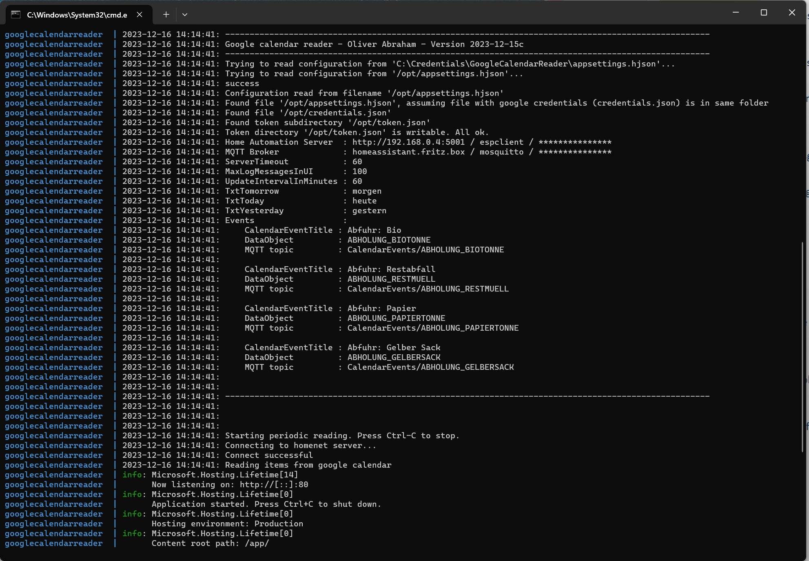
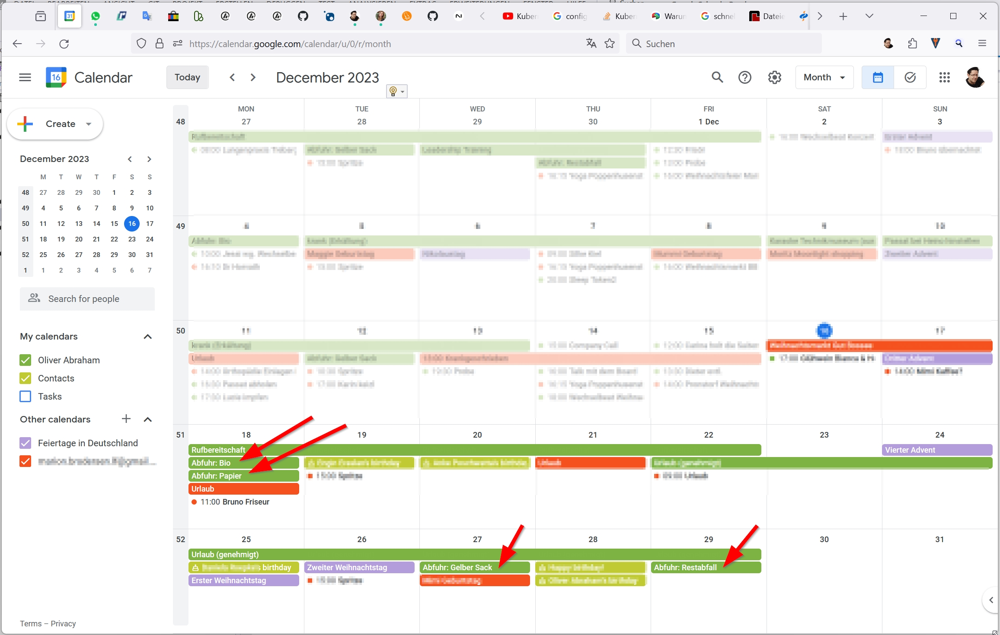
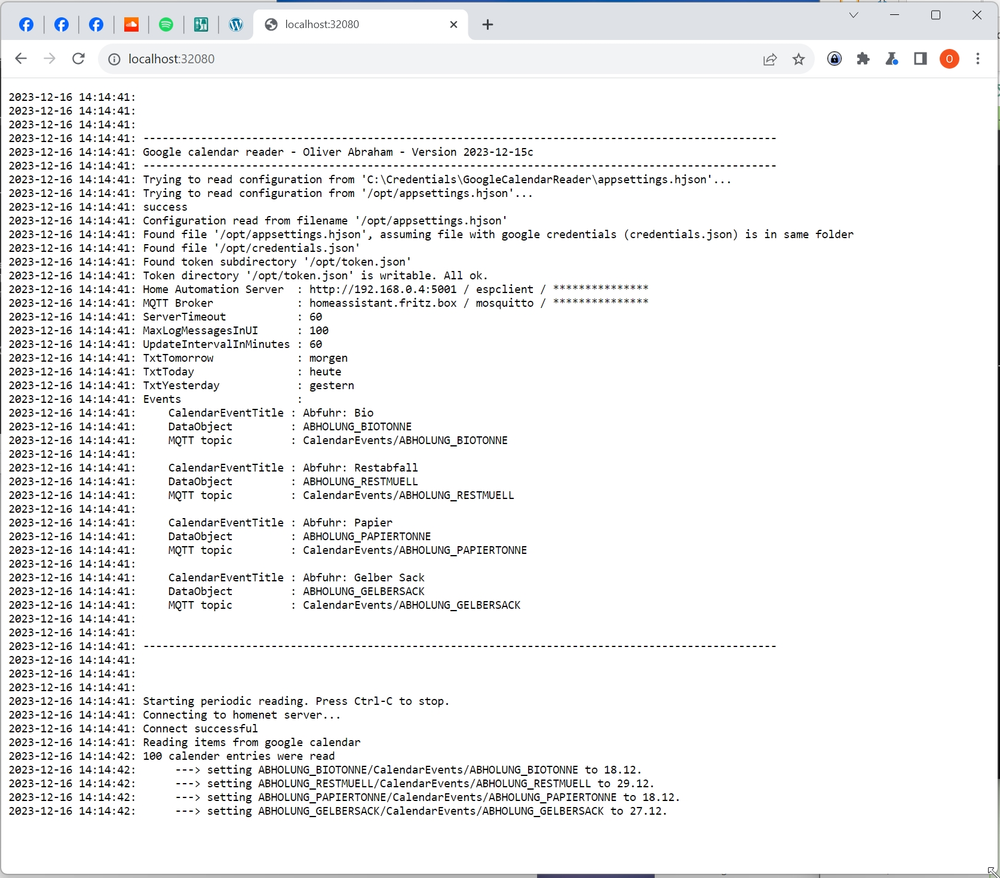
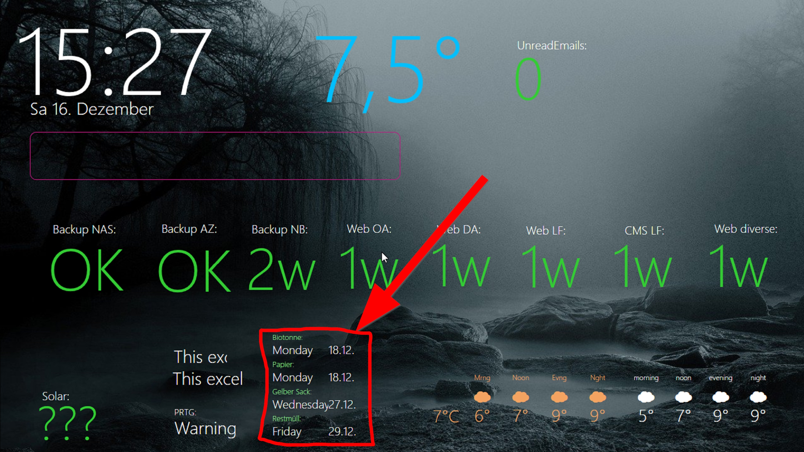
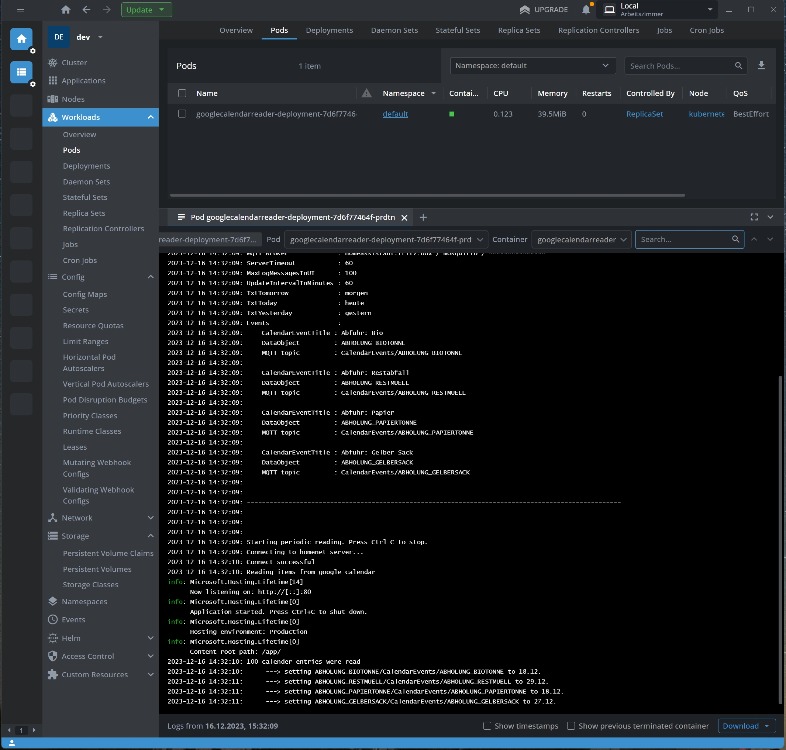

# Abraham.GoogleCalendarReader

   


## OVERVIEW

Monitors a google calender and finds certain appointments, based on a title keyword.
Then, pushes the appointment dates to an MQTT server.
This can be used, for example, to display the next garbage collection dates on your home automation dashboard.
To use it, you need an MQTT broker, for example Mosquitto (https://mosquitto.org/).
Mosquitto can also be used inside Homeassistant. (https://www.home-assistant.io/).


## IDEA

Once a year I download the garbage collection dates and import them into my google calendar.
To avoid missing the dates, I wrote this app. It drags out the relevant calendar entries 
and pushes the next date for each trash can to my dashboard.


## LICENSE

Licensed under Apache licence.
https://www.apache.org/licenses/LICENSE-2.0


## COMPATIBILITY

The application was build with DotNET 6.
You can run it as a command line application on Windows and Linux, or as a container everywhere.
I'm running it in a local kubernetes. (yaml file attached)


## INSTALLATION

You need to edit the appsettings.hjson file with your configuration first.
Take this example as a guideline:


### appsettings.hjson

On startup, the application will search first for the file in /opt/appsettings.hjson, 
then if not found in the current directory. That means if your're running the docker container,
you can mount the file from your host into the container in /opt.
Or, if you decide to compile it by yourself and run it as a command line application, 
you can put this file in the bin directory.

```
{
    ServerURL               : ""
    Username                : ""
    Password                : ""
    MqttServerURL           : "<YOUR MQTT BROKER URL>"
    MqttUsername            : "<YOUR MQTT BROKER USERNAME>"
    MqttPassword            : "<YOUR MQTT BROKER PASSWORD>"
    ServerTimeout           : 60
    MaxCalendarEventsToRead : 50
    MaxLogMessagesInUI      : 100
    UpdateIntervalInMinutes : 60
    TxtTomorrow             : "tomorrow"
    TxtToday                : "today"
    TxtYesterday            : "yesterday"
    Events: [
    {
        CalendarEventTitle  : "bio"
        DataObjectName      : "COLLECTION_BIO"
        MqttTopic           : "CalendarEvents/COLLECTION_BIO"
    },
    {
        CalendarEventTitle  : "trash"
        DataObjectName      : "COLLECTION_TRASH"
        MqttTopic           : "CalendarEvents/COLLECTION_TRASH"
    },
    {
        CalendarEventTitle  : "paper"
        DataObjectName      : "COLLECTION_PAPER"
        MqttTopic           : "CalendarEvents/COLLECTION_PAPER"
    },
    {
        CalendarEventTitle  : "plastic"
        DataObjectName      : "COLLECTION_PLASTIC"
        MqttTopic           : "CalendarEvents/COLLECTION_PLASTIC"
    }
    ]
}
```

## Configuration parameters

- ServerURL, Username, Password
These are the parameters to connect to my personal home automation server "HNServer".
This is useless for you because I haven't published this project yet.

- MqttServerURL, MqttUsername, MqttPassword
These are the parameters to connect to your MQTT broker.

- ServerTimeout
The time in seconds before giving up :-)

- UpdateIntervalInMinutes
The frequency in which the application will check the calendar.

- Events
Put your filters here.
CalendarEventTitle should contain a keyword that is part of the title of the calendar entry.
The second property, , is only for my personal home automation server.
The last entry is the MQTT topic.


### Running in Docker

To run it as a docker container, you have to mount three files into the container:
- appsettings.hjson
- credentials.json
- token.json subdirectory, containing the file from the google api authentication process.
  (named 'Google.Apis.Auth.OAuth2.Responses.TokenResponse-user^'^)

You have created the first file by yourself. The other two files are created by the google api authentication process, on the first run.
You need to run the app once locally. Then, you can copy the files to your docker host.

Start a docker container with a docker-compose.yml file like this.
(sample in my repo)

```
version: "3"
services:
  googlecalendarreader:
    image: ghcr.io/oliverabraham/googlecalendarreader/googlecalendarreader:latest
    container_name: googlecalendarreader
    ports:
      - 32080:80
    volumes:
      - /C/credentials/googlecalendarreader/:/opt/
    restart: unless-stopped
```

You should have the folder "C:\Credentials\GoogleCalendarReader" on your host, containing the files:
- appsettings.hjson
- credentials.json
- token.json subdirectory, containing the file from the google api authentication process.
  (named 'Google.Apis.Auth.OAuth2.Responses.TokenResponse-user')


## Running in Kubernetes

Start a Pod with a deployment like the one on my repo. I have mounted the files from a configmap.
There's a special point to be aware of: 
The token file for the oauth data cannot be write protected. Normally, when you start the app the first time, the google API will try to open up a browser, to redirect you to the google login page. Then, you'll be able to grant your app the rights to read your calendar.
So, to be able to execute my app in a container, you can't do this, because the container has no browser.
You have to run the app once on your local machine, to get the token file. Then, mount the file into your container.

The next problem: When you mount files from a config map, they are write protected.But the google API doesn't like the token file to be write protected. My app will detect this situation: It will create a temp folder in the container 
and copy the file 'Google.Apis.Auth.OAuth2.Responses.TokenResponse-user' to it.


## ABOUT THE WEB INTERFACE
The app has a small web interface that shows the recent log output. 
(Please forgive me, that wasn't in my focus, also adding a log file hasn't been done yet)


## ABOUT MQTT
To use my app, you need an MQTT broker, for example Mosquitto (https://mosquitto.org/).
Mosquitto can also be used inside Homeassistant. (https://www.home-assistant.io/).
The API documentation can be found at https://mqtt.org/
To get started with MQTT targets, you can start with my demo app in this repository: https://github.com/OliverAbraham/Abraham.MQTTClient. 
It will simply send a message to the broker and then exit.
To display MQTT data nicely on a dashboard, try out my dashboard app: https://github.com/OliverAbraham/AllOnOnePage


## AUTHOR

Oliver Abraham, mail@oliver-abraham.de, https://www.oliver-abraham.de
Please feel free to comment and suggest improvements!


## SOURCE CODE

The source code is hosted at:
https://github.com/OliverAbraham/GoogleCalendarReader


# SCREENSHOTS
Docker log:


My calender:


Web interface, showing that the app has found the calendar events:


My dashboard, showing the MQTT values:


The app in kubernetes, instead of docker:



# MAKE A DONATION !

If you find this application useful, buy me a coffee!
I would appreciate a small donation on https://www.buymeacoffee.com/oliverabraham

<a href="https://www.buymeacoffee.com/app/oliverabraham" target="_blank"></a>
